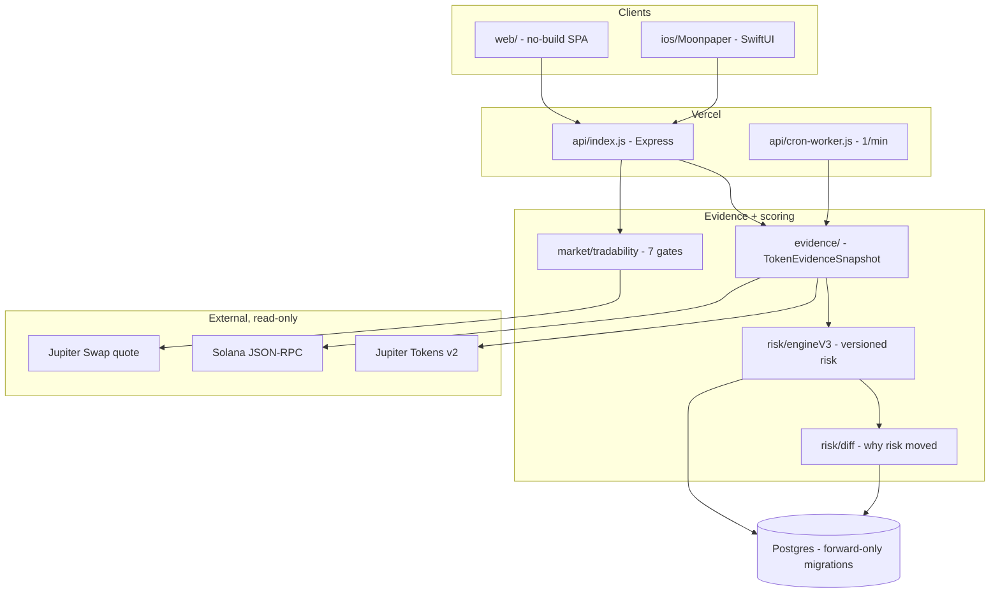

# Moonpaper

[](https://github.com/ind1254/mooncoin/actions/workflows/backend.yml)
[](https://github.com/ind1254/mooncoin/actions/workflows/ios.yml)

*Practice the moonshot — risk nothing.*

A live-research and paper-trading application with a key-free handoff to FOMO
for real execution. It answers one question:
**"Based on current market conditions, what deserves my attention, what are the
risks, and what would happen if I paper-traded it?"**

[**Live application**](https://mooncoin-two.vercel.app/) · [**Engineering view**](https://mooncoin-two.vercel.app/#/engineering) · [**One-minute walkthrough**](docs/media/moonpaper-demo.webm) · [**Case study**](docs/CASE_STUDY.md)


### Recruiter quick scan

- **Real product surface:** live Jupiter discovery, direct Solana RPC checks, exact-size quotes, and an authenticated paper portfolio deployed on Vercel.
- **Durable full-stack state:** Postgres-backed sessions, preferences, saved coins, alerts, positions, and Bot Lab decisions restore after refresh and future sign-ins.
- **Engineering proof:** 467 passing test executions, a real-browser persistence journey, 15 forward-only migrations, strict TypeScript, dependency auditing, and CI drift checks.
- **Clear ownership boundary:** simulation only; zero wallet, signing, transaction-building, custody, or real-execution code paths.

### Try it in 90 seconds

1. Open **Research** and switch between Trending and Newest to inspect the live feed.
2. Search a mint or open a card to see evidence provenance and the seven exact-size tradability gates.
3. Create an account, save a coin, change Settings, then sign out and back in—the state is restored from Postgres.
4. Open **Engineering** for the system map and decisions, then **Demo Sandbox** for the deliberately isolated seeded scenarios.

> **On naming.** The product is **Moonpaper**; the Git repository is still
> named `mooncoin` for historical reasons. Renaming the repository would break
> the existing remote, the deployment link and any shared URLs, so the name is
> left alone deliberately. Everything the repository itself controls — package
> names, UI text, docs — says Moonpaper. The GitHub *description* still
> mentions crypto arbitrage and should be updated in the repository settings;
> that field cannot be set from code.

> **Prototype — paper trading only.** Every trade is simulated with virtual funds.
> No blockchain transactions are sent, no exchange orders are placed, no funds
> are held, and no private keys or seed phrases are ever requested or stored.
> Scores describe current conditions and are **not** predictions of future
> returns. The New and Trending feeds use live Jupiter catalog data; trading
> inside Moonpaper remains simulation-only and the legacy simulator stays
> clearly labeled. Real trades are reviewed, authorized, and submitted by the
> user inside FOMO, never by Moonpaper.

## What is actually interesting here

Moonpaper is a research and paper-trading platform for Solana meme-coins. The
product is a decision aid; the engineering is about **not lying to the user**
when the data is partial, stale, or wrong.

| Area | The hard part |
|---|---|
| **Provider-unit normalization** | Jupiter types `priceImpactPct` as a bare `string` with no documented unit. It is a *fraction* (1 = 100%), which was verified empirically with a size ladder against the live endpoint rather than assumed — the previous reading was 100x too small and had silently disabled every price-impact safety gate. |
| **Solana on-chain verification** | Holder concentration is measured by classifying each top holder's owner account as a keypair wallet or a program. Naively summing the top ten counts AMM pools and bonding curves as whales, which reports the *opposite* of the truth. |
| **Explainable risk modelling** | A versioned, deterministic engine where every point is attributable, missing evidence is never treated as safe, and a chain read outranks a provider claim. No ML, no opaque score. |
| **Fixed-point financial arithmetic** | No float ever touches a persisted money value. Base units, micro-USD, pico-USD, basis points — all `bigint`, parsed from provider strings as text, with costs always rounding up. |
| **Exact-size quote simulation** | Paper fills are priced from a real quote at the real size, not a mid price. |
| **Evidence provenance** | Every fact carries `verified` / `reported` / `derived` / `stale` / `unavailable`. A missing value is never a zero and never a default. |
| **Time-series reasoning** | Bounded history with tiered downsampling, and deterministic risk-change explanations generated from stored facts rather than narrated by a model. |
| **Concurrency and idempotency** | A worker lease prevents overlapping cron runs; every worker write is idempotent because a pass may be retried. |
| **Provider degradation** | Failures are classified, not collapsed. Descriptive data may degrade to a labelled value; a quote may not, because a fabricated fill price would make the whole simulation a lie. |



**The safety boundary is structural, not a policy.** The Jupiter integration
calls `/quote` only; `assertQuoteOnlyBaseUrl()` refuses at construction any base
URL ending in `/swap`, `/order`, `/execute` or `/send`, and the response handler
rejects a body carrying transaction data. No code path ever holds a transaction
to sign, so there is nothing to custody, sign, or submit.

## The five pillars

| Pillar | What it does | Where |
|---|---|---|
| **Discover** | Confidence-ranked five-minute trending by default, with one-second refresh, automatic Smart Watch / paper-candidate queues, market cap, age, volume, liquidity, risk, and score filters | Research tab |
| **Evaluate** | Separate momentum / liquidity / execution / risk scores, each with the exact evidence that produced it | Token detail |
| **Compare execution** | Executable quotes per venue for your exact size: impact, pool fees, network + priority fees, min-received under slippage, best route vs alternatives | Token detail |
| **Paper trade** | Authenticated, persistent positions for real Solana mints. Entries rerun every production gate and store Jupiter's minimum received; closes use a fresh exact-size sell quote — never chart prices | Confirm modal / Portfolio |
| **Learn** | Database-backed virtual cash, live minimum-received marks, open/closed positions, and realized/unrealized P&L | Portfolio tab |

Plus: database-backed watchlists and user settings, and persistent in-app
alerts that always explain *why* they fired (with cooldowns and material-change
gates). Each is restored from the signed-in account rather than server memory.

## Real-trade handoff to FOMO

New and Trending cards include **Trade on FOMO**, which opens FOMO's verified
universal link with the token's immutable Solana mint and FOMO's Solana chain
identifier. On a supported phone this opens the FOMO app; otherwise it opens
FOMO's web token screen.

Moonpaper does not pass a buy/sell side or amount, connect a wallet, receive a
private key, build a transaction, or submit an order. The user must authenticate
with FOMO and review the token, amount, fees, slippage, and final confirmation
there. This keeps research and scoring separate from custody and execution.

## Shadow paper bot (Part 6)

- Each account gets an **off-by-default** `shadow-v1` strategy. Enabling it
  authorizes only automatic virtual portfolio changes; execution remains
  disabled and the worker has no transaction, wallet, signature, or key code.
- The worker scans Jupiter's five-minute trending feed, applies the same visible
  catalog quality/risk assessment, then reruns every production tradability gate
  and an exact-size quote before a simulated entry can commit.
- Exits use fresh exact-size token-to-USDC quotes with stop-loss, take-profit,
  trailing-stop, and maximum-hold rules. Unavailable exits are recorded rather
  than filled from a chart or invented price.
- Opens, closes, exact-gate rejections, unavailable exits, and worker errors are
  persisted in a per-user audit trail visible in **Bot Lab**.
- Vercel Cron invokes one bounded pass per minute. A database lease, per-minute
  idempotency key, bot position limits, cooldowns, idempotent request IDs, and a
  one-open-mint constraint keep duplicate or concurrent deliveries from
  double-opening a trade.
- A private, cursor-based FOMO sequence API exposes the same decision audit to
  an owner-controlled client. See [docs/FOMO_SEQUENCE_API.md](docs/FOMO_SEQUENCE_API.md).

## Single-owner access

Production can set a high-entropy `OWNER_API_KEY` to replace public
email/password entry with one private owner unlock. Migrations 009-010 pin the
account with an explicitly enabled Bot Lab strategy, or the oldest account when
none is enabled, preserving the active account's history. The browser exchanges
the key for an HttpOnly session cookie and never keeps it in web storage. Direct
clients can use the key as a bearer token on all private APIs. Existing owner sessions
continue to work; anonymous users still cannot read or control Bot Lab.

## Production safeguards (Part 4)

- Authentication and paper-write budgets are enforced by atomic Postgres
  counters, so limits apply across every Vercel instance. Subjects are stored
  as one-way hashes rather than raw email addresses or session identifiers.
- Each live paper entry requires a browser-generated `clientRequestId`. Replays
  return the original position under the portfolio lock and never debit cash
  twice; reusing the id for different trade parameters is rejected.
- Same-origin checks protect browser writes. CSP, HSTS, no-sniff, referrer,
  permissions, opener and resource policies are emitted on every response.
- Personal responses are `no-store`, and hostile correlation IDs are replaced
  before structured logging.

## Account lifecycle (Part 5)

- Email verification and password recovery use 256-bit, single-use tokens;
  only SHA-256 token hashes are stored. Links carry the bearer token in a URL
  fragment so it never enters ordinary HTTP access logs or referrer headers.
- Recovery always returns the same response for known and unknown addresses.
  Resetting a password revokes every session, and expired or replayed links are
  rejected atomically by Postgres.
- When verification enforcement is enabled, unverified users can still use all
  public research and live quotes but cannot mutate a portfolio or watchlist.
  Existing production users are migrated as verified to prevent lockout.
- Delivery uses Resend only when `RESEND_API_KEY` and a verified
  `ACCOUNT_EMAIL_FROM` are configured. `EMAIL_VERIFICATION_REQUIRED` cannot be
  enabled without both, so a partial email setup cannot strand new accounts.

## Quick start

Prerequisites: Node.js ≥ 20. No provider credentials, API keys, or wallet are
required for local development.

```powershell
cd backend
npm install
$env:LOCAL_DB="true"
$env:COOKIE_SECURE="false"
npm run dev:local
```

On macOS/Linux, use `LOCAL_DB=true COOKIE_SECURE=false npm run dev:local`.

Open **http://localhost:8787** — the web app. New and Trending token feeds come
from Jupiter. Create an account to persist watchlist state and live-quote paper
positions in the local PGlite database. The separate Demo Sandbox remains a
deterministic demonstration.

### Environment variables

See [backend/.env.example](backend/.env.example). The live providers work on the
keyless compatibility host by default; production can set `JUPITER_API_KEY` and
the official `api.jup.ag` URLs. Server-owned eligibility policy is configured by
`TRADABILITY_MIN_LIQUIDITY_USD` (10,000),
`TRADABILITY_MAX_PRICE_IMPACT_BPS` (300), and
`TRADABILITY_MAX_MARKET_AGE_MS` (300,000). Live paper limits use
`PAPER_MIN_TRADE_USD` (10), `PAPER_MAX_TRADE_USD` (10,000), and
`PAPER_MAX_OPEN_POSITIONS` (25). Client controls cannot weaken these policies.
Durable abuse budgets use `AUTH_RATE_LIMIT_ATTEMPTS`,
`AUTH_RATE_LIMIT_NETWORK_ATTEMPTS`, `AUTH_RATE_LIMIT_WINDOW_MS`, and
`PAPER_RATE_LIMIT_ATTEMPTS` / `_WINDOW_MS`.
Production accounts require `DATABASE_URL`; local development can use
`LOCAL_DB=true` for the same migrations and constraints in PGlite.
Account links use the fixed `PUBLIC_APP_URL` rather than request headers.

### Tests & checks

```bash
cd backend
npm run typecheck   # strict TypeScript, no emit
npm test            # 467 unit/integration test executions across 43 suite files
npm run test:e2e    # real Chromium account-persistence journey
npm run audit:prod  # fail on moderate-or-higher production dependency findings
npm run build       # compile the production server
```

CI runs all of the above, validates the browser JavaScript, checks generated
repository metrics, and fails if the committed production build drifts from
reviewed source.

## Architecture

```
web/                    Vanilla-JS SPA (no build step) — Discover, token detail,
                        trade confirmation, portfolio, settings, alerts drawer
backend/src/
  market/               Provider interfaces plus live Jupiter token/search/feed,
                        quote and tradability adapters, Solana mint verification, and the
                        deterministic seeded simulator.
                        All values normalized with mint identity, source,
                        timestamp, age, and reliability.
  scoring/              Transparent rule-based scores (0-100) with stored factors
  paper/                Deterministic demo engine plus live-quote paper service
  bot/                  Opt-in shadow strategy + persistent worker pass; paper only
  worker/               Shared one-pass runtime, Vercel Cron handler, DB lease
  auth/ db/             Password sessions, Postgres migrations and repositories
  notify/               Notification rules: cooldowns, transitions, explanations
  settings/             Validated defaults plus account-backed preferences
  api/                  createApp() factory, demo seeding, server entry, legacy
                        arbitrage-calculator routes (original add-on, still works)
  core/ adapters/ ...   Original arbitrage engine (BigInt money math) — reused
ios/ArbitrageAddOn/     SwiftUI module for the original arbitrage calculator
ios/Moonpaper/          Native SwiftUI iPhone app: live discovery, search,
                        research, risk explanations, and manual FOMO handoff
demo/                   Original phone-frame arbitrage demo (served at /demo)
                        (Mentions of "Fomo" in ios/, demo/, and docs/ refer to
                        the unrelated third-party app the original add-on would
                        integrate with — they are not this product's name.)
db/schema.sql           Postgres schema for the legacy calculator (future use)
```

**Financial precision rule:** SOL amounts are bigint lamports, USD values are
bigint micro-USD, token prices are bigint pico-USD, token amounts are bigint
base units. Floats appear only when *generating* simulated market data and in
display formatting — never in balances or P&L.

**Provider boundary:** live discovery uses Jupiter Tokens V2 (`recent` and
`toptraded/5m`) with a one-second, single-flight cache. The live-v2 score is
recomputed from market depth, five-minute demand, fast safety signals, maturity,
and evidence coverage; it is a current-condition score, not a profit probability.
Arbitrary-token research resolves by
mint and verifies authority settings through read-only Solana RPC. Quotes use
Jupiter's read-only quote route with no fabricated fallback. The production
eligibility service combines those independent sources for one exact USDC size:
fresh catalog timestamp, minimum liquidity, direct mint/freeze authority reads,
duplicate-symbol warning, fresh route, and maximum impact. The simulator stays
isolated and honestly labeled demonstration data. Live paper entries rerun the
same gates server-side, store exact token units and the quoted minimum received,
and revalue or close with fresh token-to-USDC quotes.

## API sketch

```
GET  /health                        GET  /v1/meta
GET  /v1/feed                       ?kind&minQualityScore&maxRiskScore&minLiquidityUsd&minMarketCapUsd&maxMarketCapUsd&minAgeMinutes&maxAgeMinutes&minVolume5mUsd&verifiedOnly&sort&search
GET  /v1/tradability/:mint          ?amountUsd&slippageBps (seven production gates)
GET  /v1/quote                      ?inputMint&outputMint&amount&slippageBps
POST /v1/auth/signup                {email, password}
POST /v1/auth/signin                {email, password}
POST /v1/auth/signout
POST /v1/auth/forgot-password       {email}
POST /v1/auth/reset-password        {token, password}
POST /v1/auth/verify-email          {token}
POST /v1/auth/resend-verification
POST /v1/owner/unlock             Authorization: Bearer <owner-key>
GET  /v1/me
GET  /v1/me/portfolio
GET  /v1/me/watchlist              POST /v1/me/watchlist
DELETE /v1/me/watchlist/:mint
GET  /v1/me/settings               PUT /v1/me/settings
GET  /v1/me/notifications          POST /v1/me/notifications/mark-read
GET  /v1/me/paper-bot              (strategy, worker status, decision audit)
PUT  /v1/me/paper-bot              (enable/disable and bounded strategy settings)
GET  /v1/integrations/fomo/sequences ?cursor&limit (owner-only paper decisions)
POST /v1/me/paper/positions         {clientRequestId, tokenMint, amountUsd, slippageBps?}
POST /v1/me/paper/positions/:id/close {slippageBps?}
GET  /v1/opportunities              ?tradeSizeSol&risk&minLiquidityUsd&search
GET  /v1/tokens/:mint               ?tradeSizeSol      (detail + scores + evidence)
GET  /v1/tokens/:mint/routes        ?tradeSizeSol&slippageBps
POST /v1/paper/positions            {tokenMint, solAmount, slippageBps?}
POST /v1/paper/positions/:id/close
GET  /v1/paper/portfolio
GET  /v1/notifications              POST /v1/notifications/mark-read (legacy demo)
GET  /v1/settings                   PUT  /v1/settings              (legacy demo)
POST /v1/watchlist                  {mint, watched}                 (legacy demo)
POST /v1/arbitrage/calculate        (legacy calculator, USD-denominated)
```

Errors are structured: `{error: CODE, message, details}` with codes like
`INSUFFICIENT_PAPER_BALANCE`, `PRICE_IMPACT_TOO_HIGH`, `NO_QUOTE_AVAILABLE`,
`STALE_QUOTE`, `RATE_LIMITED`, `ORIGIN_NOT_ALLOWED`, `TOKEN_NOT_ALLOWED`,
`VALIDATION_ERROR`. Rate-limit responses include `Retry-After` and
`RateLimit-*` headers.

## Demo scenarios (seeded, deterministic)

| Token | Scenario |
|---|---|
| BONK | Strong opportunity — volume accelerating, deep stable liquidity, low impact |
| POPCAT | Marginal — decent momentum, thinner liquidity, one venue missing |
| FLOOF *(synthetic)* | High risk — 2 days old, 62% holder concentration, live mint authority, draining liquidity, parabolic pump. Ranks **AVOID** |
| WIF / MEW / PNUT | Healthy-quiet, negative momentum, and volatile-with-stale-feed respectively |

The demo portfolio seeds one open position (WIF), one profitable close (BONK
+8.4%), and one losing close (FLOOF −23.5%) so every product state is visible
immediately.

## Known limitations

- The live home feed is request-driven and refreshed through a one-second
  single-flight cache; upstream values can still update less frequently. It is not a
  durable chain-indexing pipeline and does not backfill missed program events.
- Jupiter catalog presence and reported liquidity do not prove that a route is
  executable for a particular size. The UI exposes a server-side production
  check that blocks stale/thin/authority-controlled/high-impact tokens and
  independently verifies a fresh Jupiter route for the requested amount.
- The keyless `lite-api.jup.ag` compatibility endpoints remain the zero-setup
  default. A production operator should set a Jupiter Developer Platform key
  and official endpoint URLs for monitored rate limits and long-term support.
- Solana's public RPC can rate-limit on-chain authority verification. When it
  does, Moonpaper shows verification as unavailable rather than trusting a
  provider claim as chain truth.
- Accounts, sessions, settings, watchlists, virtual cash, live paper positions,
  Bot Lab configuration/decisions, alerts, and one-time account actions persist
  in Postgres (or PGlite locally). Production email delivery still requires a
  verified sender domain in Resend.
- In-app notifications only; no push. Alerts and the shadow bot run through the
  production Vercel Cron function described in `docs/ALERT_WORKER.md`; the
  one-minute schedule requires a Pro or Enterprise Vercel plan.
- The iOS SwiftUI module covers the original arbitrage calculator, not the new
  paper-trading UI; the web app is the reference front end.
- Simulated fills assume the min-received of the best quote — conservative, but
  still a model. Real execution differs (MEV, partial fills, congestion).

## Safety boundaries (non-negotiable)

- No transaction building, signing, or submission anywhere in the codebase
- No custody, no fund transfers, no exchange orders, no real-money auto-trading
- Automated actions are restricted to simulated database positions and are
  disabled per account by default
- No private keys or seed phrases, ever
- No profit guarantees; simulated results are labeled simulated everywhere

## Known limitations

Stated plainly, because a research tool that hides its gaps is worse than one
that has none.

- **Wallet cohorts are unavailable, not zero.** Developer, insider, bundler,
  sniper and smart-trader shares need a labelling provider that is not wired up.
  They report as `unavailable` with a reason rather than as 0%, because unknown
  and zero are different claims and only one of them is true.
- **True mint creation time is unavailable.** Jupiter's first-pool timestamp is
  a first *sighting*, not a creation time, and the two are never substituted.
  Deriving the real one needs indexed transaction history.
- **Metrics are per-instance.** `/admin/metrics` counters describe one
  serverless instance since it started; instances recycle and the snapshot says
  so rather than implying a global total.
- **`backend/dist` is committed.** The root `postinstall` needs it to pre-exist,
  and `vercel.json` ships it via `includeFiles`, so removing it requires
  redesigning the build ordering first. CI fails if it drifts from source.
- **Swap V2 needs an API key.** It is served only from `api.jup.ag`, which
  allows roughly five keyless requests before rate-limiting, so V1 remains the
  default and V2 activates when a key is configured.
- **The repository is named `mooncoin`.** See the naming note above.
- **Scores are not predictions.** They describe current conditions. Nothing here
  is financial advice, and no part of the system executes a trade.
