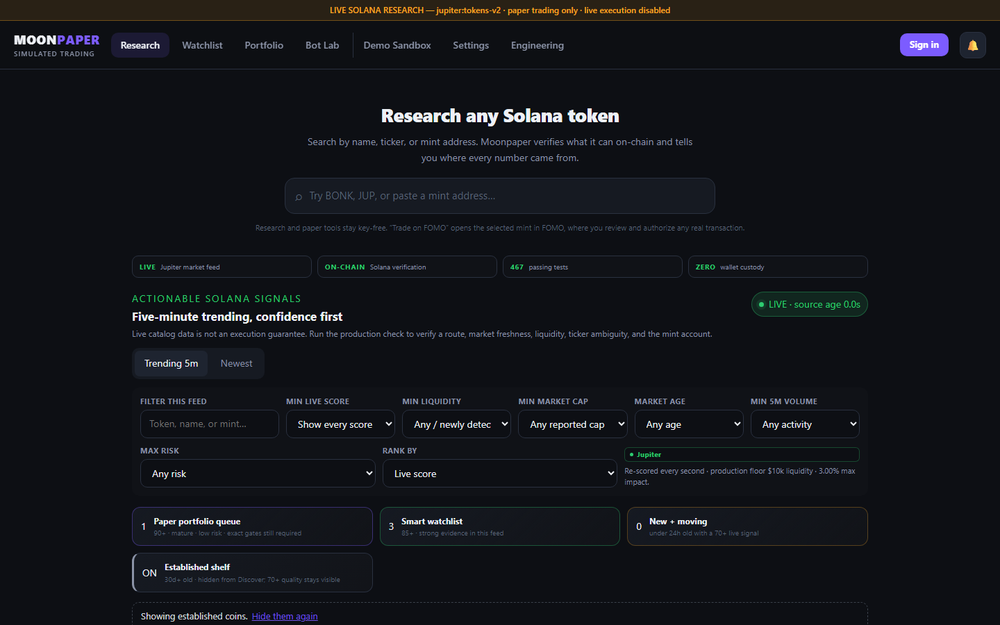
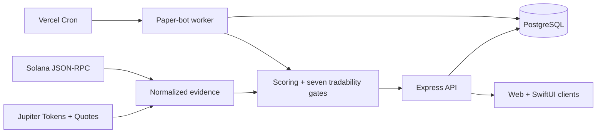

# Moonpaper engineering case study

Moonpaper is a production-deployed Solana research and paper-trading application. I built it to answer a deceptively difficult product question: how can a trader inspect fast-moving tokens without the software pretending uncertain data is safe or simulated execution is real?

[Open the live application](https://mooncoin-two.vercel.app/) · [View the recruiter-facing engineering page](https://mooncoin-two.vercel.app/#/engineering) · [Watch the one-minute walkthrough](media/moonpaper-demo.webm)

## The problem

Meme-coin dashboards often collapse several different claims into one confidence number. A catalog price can look like an executable price, missing holder data can look like zero concentration, and a token symbol can be mistaken for an identity. Those shortcuts make a polished interface while hiding the most important engineering facts.

Moonpaper treats the product as an evidence pipeline. It discovers live Solana tokens, verifies independent facts when possible, records where every value came from, applies visible policy gates, and keeps all trading activity inside a virtual portfolio.

## Constraints

- No wallet connection, key custody, transaction construction, signing, or submission.
- Persisted money cannot use floating-point arithmetic.
- Missing or stale provider evidence must remain visible—not become a safe default.
- Retried requests and overlapping worker runs cannot duplicate paper trades.
- The same account state must survive refreshes, cold starts, and future sign-ins.
- The application must remain useful when an upstream provider is delayed or unavailable.

## Architecture

The web client never decides whether a paper entry is safe. The backend reruns the live gates for the exact requested USDC size, obtains a current quote, stores minimum received, and updates cash and positions in one database transaction. Production uses Postgres; local development and automated tests use PGlite with the same migrations and constraints.

## Decisions that carry the project

### Exact money math

SOL amounts are integer lamports, USD values are integer micro-USD, token prices are integer pico-USD, and token amounts are integer base units. Costs round against the simulated trader. This avoids the silent drift that appears when tiny token prices and large supplies pass through JavaScript numbers.

### Evidence before scoring

Every fact is classified as verified, reported, derived, stale, or unavailable. The risk engine stores the factors that produced each score. Direct chain evidence outranks provider claims, and an unknown value never becomes zero.

### Execution-shaped simulation

Paper entries and exits use an executable Jupiter quote for the exact size rather than a chart midpoint. The persisted fill is the conservative minimum received under slippage. If a quote is stale or unavailable, Moonpaper reports that state instead of inventing a fill.

### Durable ownership boundaries

Sessions, preferences, saved coins, notification state, virtual balances, positions, Bot Lab configuration, and the bot decision audit are account-scoped in Postgres. Browser writes are same-origin protected; retryable paper entries use UUID idempotency keys under the portfolio lock.

### Safe automation

The shadow bot is off by default and can mutate only simulated records. A database lease prevents overlapping scheduled passes, and per-minute idempotency prevents the same pass from opening a position twice.

## Failure handling

Provider failures are classified instead of flattened into a generic success. Catalog data may degrade to a clearly labeled stale value. Quotes may not degrade because a fabricated quote would corrupt the simulation. Solana RPC rate limits surface authority evidence as unavailable rather than allowing a provider claim to masquerade as chain truth.

## Proof, not just claims

- 467 passing unit and integration test executions across 43 suite files.
- A Playwright browser journey creates an account, changes preferences, saves a coin, reloads, signs out, signs in again, and verifies both settings and watchlist restoration.
- 15 forward-only database migrations shared by production and local tests.
- CI runs strict TypeScript, browser JavaScript syntax validation, dependency audit, unit/integration tests, the browser journey, a production build, documentation-metric drift checks, and compiled-output verification.
- The public Engineering page explains the architecture and boundaries inside the product.

## What I would build next

The next meaningful step is a durable chain-indexing pipeline with backfill, followed by a labeled-wallet data source and push delivery for high-value alerts. Those additions would expand evidence coverage; they would not weaken the existing rule that unavailable data stays unavailable.

## Honest scope

Moonpaper is a portfolio project and paper-trading prototype, not financial advice or a profit engine. It does not execute real trades, predict returns, or claim to be a complete blockchain indexer. The iOS module represents an earlier product phase; the web application is the reference experience.
