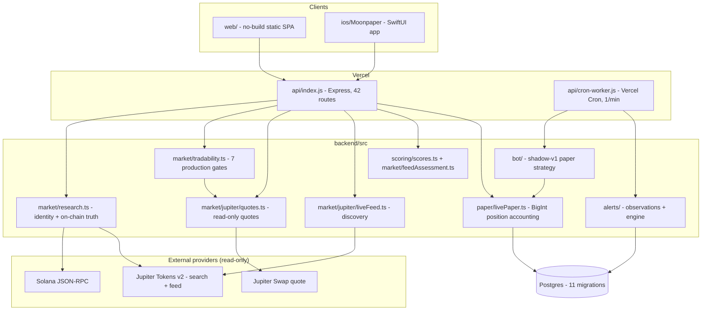

# Current Architecture

A description of what the system does **today**, from a read of the source at
commit `945057c`, kept current as the system changes.

<!-- METRICS:INLINE:START (generated by backend/scripts/repo-metrics.mjs — do not edit by hand) -->
Verified counts: 43 HTTP routes, 12 forward-only migrations, 37 test files / 395 declared test cases, all passing.
<!-- METRICS:INLINE:END -->

This document describes reality, not intent. Known gaps are recorded in
[TECHNICAL_AUDIT.md](TECHNICAL_AUDIT.md); planned work is in
[NEXT_PHASE.md](NEXT_PHASE.md).

---

## 1. What the product is

Moonpaper is a **research and paper-trading** platform for Solana meme-coins.
It answers two questions about a token — *what is actually true about it?* and
*what would a trade of this size actually cost?* — and lets the user simulate
positions against live quotes.

### The safety boundary

The application **never**: custodies funds, requests private keys or seed
phrases, signs transactions, submits transactions, or executes real trades.
There is no wallet execution path in the codebase.

This is enforced structurally, not by policy: the Jupiter integration calls the
`/quote` endpoint only and never `/swap`, so no code path ever holds a
transaction to sign. A scan of `src/`, `web/`, `api/` and `ios/` for
`privateKey`, `secretKey`, `mnemonic`, `signTransaction`, `sendTransaction`,
`Keypair` and `/swap` returns only comments and URL constants asserting the
boundary — no call sites.

The FOMO handoff is the single outward path, and it hands the user a *described
intent* to review and execute themselves inside FOMO. Moonpaper does not act
on it.

---

## 2. Runtime shape

**Deployment.** Two Vercel serverless functions plus static assets.
`vercel.json` pins security headers globally and a per-route CSP, routes
`/v1/*` and `/admin/*` to the API function, and schedules `/api/cron/worker`
every minute.

---

## 3. The provider model

Three external sources, each with a distinct role. The separation of
*authority* between them is the central design idea of the codebase.

| Source | Answers | Trust level |
|---|---|---|
| Jupiter Tokens v2 | Which token is this? What is the market doing? | **reported** — provider claim |
| Jupiter Swap quote | What would this exact size actually return? | **reported**, but a direct simulation |
| Solana JSON-RPC | What can the token's owner actually do? | **verified** — read from chain |

`market/research.ts` states the rule explicitly: the discovery provider answers
identity and market facts, the chain answers authority, and **where both speak,
the chain wins and the disagreement is surfaced rather than hidden**.

### Data provenance

Every fact carries a `FactStatus` of `verified` (read from chain), `reported`
(provider claim), or `unavailable`. Nothing is fabricated: a metric with no
provider is reported as unavailable rather than defaulted, and missing evidence
is never treated as safe.

Quotes deliberately break the degradation pattern used elsewhere. Descriptive
data may fall back to a labelled simulated value; a quote may not, because a
fabricated fill price would make the entire simulation a lie. If Jupiter cannot
answer, the quote is unavailable and the user is told.

---

## 4. Financial representation

No JavaScript float ever touches a persisted financial value.

| Quantity | Representation |
|---|---|
| Token amounts | `bigint` base units (mint decimals) |
| USD notionals | `bigint` micro-USD (1e6) |
| Prices | `bigint` pico-USD (1e12) |
| Rates, impact, slippage | `bigint` basis points |
| Scores | plain `number` 0-100 — qualitative, never money |

Provider values arrive as **strings** and are parsed as text straight to
`BigInt`, because Jupiter returns more precision than a float holds (e.g.
`"0.001366339669935170085524648"`). Rounding on any cost borne by the user is
always **up** (`bpsOfCeil`, `priceImpactFractionToBpsCeil`).

`scoring/scores.ts` documents the one exception: plain numbers are fine for
scores because they are qualitative indicators, not financial amounts.

---

## 5. Solana on-chain verification

`market/solana/` reads the chain directly rather than trusting provider claims.

- **`mint.ts`** decodes the mint account for `mintAuthority`,
  `freezeAuthority`, `decimals` and `supply`. Supports SPL Token and
  Token-2022.
- **`holders.ts`** measures holder concentration, and is the most subtle module
  in the repository.

### Why holder concentration is not a naive top-10 sum

Summing the ten largest balances and dividing by supply is wrong for almost
every token the app shows, **and wrong in the dangerous direction**. The
largest holders of a meme coin are usually not people: they are the bonding
curve that minted it, AMM pool vaults, and exchange omnibus wallets. Supply
parked in a liquidity pool is supply anyone can trade against — counting it as
"one holder owns 62%" reports the opposite of the truth, turning a deep pool
into a rug warning until users learn to ignore the warning.

The fix is another chain read rather than a heuristic. Every token account names
an `owner`; every owner is itself an account with its own program owner. An
address owned by the System Program is a plain keypair wallet. Anything else is
program-derived — a pool, a curve, a vault — and cannot be a person.

Cost is three RPC calls regardless of holder count:
`getTokenLargestAccounts` → `getMultipleAccounts` (decode owners) →
`getMultipleAccounts` (classify owners).

---

## 6. Execution intelligence: quotes

`market/jupiter/quotes.ts` normalizes a read-only quote into
`NormalizedSwapQuote`, insulating all domain code from Jupiter's response
shape.

Captured today: `inAmount`, `outAmount`, `minOutAmount` (slippage-adjusted
threshold), `slippageBps`, `priceImpactBps`, the full `routePlan` with per-hop
venue labels and split percentages, `swapUsdValueMicro`, `contextSlot`,
`swapMode`, `platformFee`, per-hop `inAmount`/`outAmount`/`updateContextSlot`,
`providerLatencyMs`, `providerRequestId` (trace header), `instructionVersion`,
`apiVersion`, `retrievedAtMs`, and an application-owned `expiresAtMs`.

`expiresAtMs` is **Moonpaper's** freshness policy, not something Jupiter
returns — recorded so a later step can reject a stale quote.

Failures are classified rather than collapsed: `PROVIDER_TIMEOUT` (504),
`PROVIDER_RATE_LIMITED` (503, carrying `retry-after`), `QUOTE_UNAVAILABLE`
(409, for Jupiter's 400/404 "no route" answer), `MALFORMED_PROVIDER_RESPONSE`
(502). A short cache (5s success, 3s failure, 20s rate-limit) absorbs
double-clicks without ever showing a meaningfully out-of-date quote.

### API generation and provenance

The provider talks to Jupiter Swap **V1 by default and V2 when an API key is
configured**. Jupiter documents V1/Metis as superseded, but V2 is served only
from `api.jup.ag`, which without a key allows ~5 requests before 429 (measured
2026-09-01); the keyless `lite-api` host does not serve V2 at all. The two
quote responses are structurally identical, so V1 loses no data. Switching is a
two-line env change (`JUPITER_QUOTE_URL` + `JUPITER_API_KEY`).

Provenance is **derived from the URL actually called** via
`inferApiVersionFromUrl()`, not stamped from a constant — the previous
hardcoded `jupiter:quote-v1` was wrong for any overridden endpoint.

Quote-only is enforced in code: `assertQuoteOnlyBaseUrl()` rejects a base URL
ending in `/swap`, `/order`, `/execute` or `/send` at construction, and the
response handler refuses any body carrying transaction fields.

### Provider unit semantics

`market/jupiter/units.ts` is the single audited home for the `priceImpactPct` →
basis-points conversion. It is a domain boundary on purpose: this one
conversion feeds every price-impact safety gate in the system, and an error
here is silent. See the audit for the 100x bug found and fixed here.

---

## 7. The four assessment paths

These are **not** duplicates. They have distinct responsibilities and distinct
inputs, and collapsing them would lose information.

| Module | Question | Input | Output |
|---|---|---|---|
| `market/feedAssessment.ts` | Is this discovery-feed row worth a look? | one `LiveFeedToken` row | `live-v2` quality/confidence/momentum/risk + signal |
| `market/research.ts` | What is verifiably true about this token? | chain reads + provider facts | risk factors with `FactStatus` provenance |
| `scoring/scores.ts` | How do current conditions rank? | market view + route comparison | 5 pillars: momentum, liquidity, execution, risk, opportunity |
| `market/tradability.ts` | May we simulate a trade at all? | research + a real quote | 7 pass/warning/fail/unavailable gates |

`feedAssessment` is cheap and runs over many rows from one API response.
`research` is expensive and runs per token with RPC reads. `scores` ranks.
`tradability` is the production gate that actually blocks a simulated entry.

Only `feedAssessment` currently carries an explicit model version
(`scoreVersion: "live-v2"`). The others do not — a gap recorded in the audit.

### The seven tradability gates

`market_freshness`, `minimum_liquidity`, `mint_authority`, `freeze_authority`,
`duplicate_symbol`, `jupiter_route`, `price_impact`. Each carries a `status`, a
`blocking` flag (warning-only gates are visible but do not block), a human
`detail`, and a `source`.

`duplicate_symbol` exists because ticker symbols are not identity — several
distinct mints share "BONK", and the recorded fixtures cover exactly that case.

---

## 8. Paper trading

`paper/livePaper.ts` is the live-quote position engine, and the only place that
mutates portfolio value.

- Entries and exits are priced from **real quotes at real size** — an
  exact-size simulation, not a mid-price fill.
- Entry is refused when price impact exceeds `maxEntryPriceImpactBps`, when
  liquidity is below the floor, or when the quote is stale or unavailable.
- Positions record `entryPriceImpactBps` and `exitPriceImpactBps`, so what the
  simulation charged is auditable after the fact.
- Position sizing, P&L and portfolio cash are `bigint` micro-USD throughout;
  `returnBps` computes return in basis points.
- Internal fields (`openedBy`, `botConfigId`) are worker-only and are never
  accepted from a browser route.

Financial mutations run inside transactions with invariant tests, and writes are
idempotent — the cron worker runs every minute and must be safe to retry.

---

## 9. The shadow paper bot

`bot/` implements one strategy, `shadow-v1`. It is **opt-in, disabled by
default, and private to a single owner account**. It never touches real money —
it opens and closes simulated positions through the same `livePaper` engine a
human uses, against the same gates.

`bot/strategy.ts` decides entries from candidate quality and exits on
`liquidity_risk` when current price impact exceeds twice the configured entry
limit. `bot/worker.ts` runs a pass, recording the quote impact it acted on.

---

## 10. Alerts, observations and the worker

- `alerts/observations.ts` records what was observed about a token.
- `alerts/engine.ts` turns observations into alerts.
- `worker/pass.ts`, `worker/runtime.ts`, `worker/vercel.ts` run a scheduled
  pass; migration `008_worker_lease.sql` provides a **lease** so overlapping
  cron invocations cannot double-run, with duplicate run keys rejected.

Migration `006_token_observations.sql` deliberately stores only the **latest**
row per token and overwrites it — a reasonable MVP choice that currently makes
historical questions ("what was risk an hour ago?") unanswerable.

---

## 11. Auth, accounts and persistence

`auth/` provides password hashing (`password.ts`), sessions, and an account
lifecycle (`accountLifecycle.ts`) covering verification and recovery. Ownership
checks gate every per-account resource. Migrations `009_single_owner.sql` and
`010_prefer_enabled_owner.sql` pin the bot to one active owner account.

`db/repositories.ts` is the single data-access layer. Tests run against
**PGlite**, so every migration is exercised with Postgres-compatible SQL on
every test run. Migrations are forward-only.

---

## 12. Testing and CI

Run with vitest (see the counts above). Provider integrations are tested
offline against **recorded fixtures** (`tests/fixtures/jupiter/`,
`tests/fixtures/solana/`), refreshed manually by scripts in `backend/scripts/`
and never from CI.

Fixture discipline: recorded market values drift, so tests assert on **shape
and stable identity** (mint, decimals, tokenProgram, symbol) and on
**relationships** (min ≤ out, exact BigInt parsing), never on price or
liquidity magnitudes.

CI currently covers **iOS only** (`.github/workflows/ios.yml`). There is no
backend workflow — see the audit.
