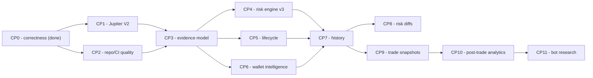

# Next Phase

Sequenced plan following the Checkpoint 0 correctness work. Ordering is
deliberate: correctness, then the foundations later checkpoints depend on, then
intelligence features.

Checkpoints 0, 1, 3 are complete and Checkpoint 2 is partly done — see
[TECHNICAL_AUDIT.md](TECHNICAL_AUDIT.md). Checkpoint 3 shipped as
`src/evidence/` (`types.ts`, `build.ts`) with 19 tests.

---

## Dependency order



The critical insight: **Checkpoint 3 (unified evidence) gates almost
everything downstream**. Checkpoints 4, 5, 6 all produce evidence; 7, 8, 9, 10
all consume it. Building any of them before the evidence representation exists
means building them twice.

---

## Checkpoint 1 — Jupiter API modernization

**Gap.** Defaults to `lite-api.jup.ag/swap/v1`; the legacy adapter uses
`quote-api.jup.ag/v6`. Jupiter documents Metis/Swap V1 as superseded by
Swap V2. Provenance is stamped `jupiter:quote-v1`.

**Work.**
- Migrate the read-only quote path to the current recommended mechanism.
- Capture more execution intelligence where available: priority/network fee
  estimates, USD in/out values, provider timestamp and trace id, explicit
  freshness.
- Update `JUPITER_QUOTE_SOURCE` to the version actually called.
- Re-record fixtures; keep tests deterministic.
- Consolidate the legacy adapter onto the same provider.

**Boundary.** Quote-only. Never call an execute endpoint. If a response can
carry an unsigned transaction, request quote-only mode where supported;
otherwise discard it immediately — never persist it, never expose it to the
browser.

**Contained by.** The existing `QuoteProvider` interface already insulates
domain code from the response shape.

---

## Checkpoint 2 — Repository and CI quality

Highest leverage per unit of effort, and a prerequisite for trusting everything
after it.

- **Backend CI** — a workflow running `npm ci`, `typecheck`, `test`, `build`
  with dependency caching, failing on any error. No production migrations from
  CI. Badge in the README.
- **Brand** — pick one canonical name and make README, package metadata, UI
  text and docs agree. Not a blind rename: check deployment and API
  implications first.
- **`PROJECT_SUMMARY.md`** — rewrite to describe current functionality; remove
  claims that something is missing when it now exists. Generate counts (tests,
  routes, migrations) rather than hardcoding numbers that go stale.
- **`backend/dist`** — redesign the build/deploy ordering before removing it.
  The blocker is the root `postinstall` needing `dist` to pre-exist, plus
  `vercel.json` `includeFiles`. Removing it naively breaks production.
- **Workspaces** — evaluate root + backend manifests. Document the migration
  before restructuring; do not restructure for aesthetics alone.

---

## Checkpoint 3 — Unified evidence model  ✅ **done**

**Not a merge of the four assessment paths.** They have genuinely distinct
responsibilities (see CURRENT_ARCHITECTURE §7) and collapsing them would lose
information. The goal is a shared *representation of facts* that each path can
reason from.

`TokenEvidenceSnapshot` with `mint`, `observedAt`, `identity`, `market`,
`momentum`, `liquidity`, `holders`, `authorities`, `walletBehaviour`,
`execution`, `freshness`, `unavailableEvidence`, `sources`.

Each field keeps `value`, `status`, `source`, `observedAt`, and confidence
where applicable. Statuses extend today's `FactStatus`: `verified`, `reported`,
`derived`, `stale`, `unavailable`.

**Constraint.** The existing provenance model is already precise. The new
abstraction must be a strict superset — it must not flatten `verified` vs
`reported`, which is the distinction the whole risk model rests on.

---

## Checkpoint 4 — Risk engine v3  ✅ **done**

Versioned risk over structured evidence, returning `riskScore`,
`riskConfidence`, `riskLevel`, `riskModelVersion`, `factors[]`,
`missingEvidence[]`, `observedAt`.

**Preserve:** explainable factors, no opaque ML score, missing data never
silently safe, direct chain evidence outranking provider claims.

**Keep separate — do not conflate:** Risk, Momentum, Market Quality, Execution
Quality, Opportunity. A risky token can have momentum; a safe token can be a
terrible trade. Specifically, `riskScore` must never become the opportunity
score.

Every scoring change gets a version bump, and historical snapshots retain the
version that produced them (closes Finding 7).

---

## Checkpoint 5 — True token lifecycle

Keep `research.ts`'s existing honesty: it correctly refuses to call Jupiter's
indexing/first-pool time the true mint creation time.

Separate timestamps, never substituted for one another: `mintCreatedAt`,
`firstPoolCreatedAt`, `firstProviderObservedAt`.

Investigate deriving real mint creation from indexed transaction history or a
dedicated Solana data provider; evaluate rate-limit cost and cache aggressively
(lifecycle data is immutable once known). **If creation time cannot be
verified, leave it unavailable.**

---

## Checkpoint 6 — Wallet and holder intelligence

Build on `solana/holders.ts`, preserving its pool/curve exclusion.

Extend toward developer-linked, insider-labelled, bundler, sniper and
smart-trader cohorts, plus accumulation/distribution and funding
relationships. Likely needs a dedicated provider.

**Never fabricate a label.** Every classification carries source, confidence,
`observedAt` and evidence. Never assert two wallets are the same human — use
"funding relationship observed", "provider-labelled insider", "possibly
related".

Expose `topEconomicHoldersPct`, `developerWalletPct`, `insiderPct`,
`bundlerPct`, `sniperPct`, `smartTraderPct` where data is reliable — and treat
**change** as the product: `developer share 8.2% → 5.7%` is the event, not the
level.

---

## Checkpoint 7 — Historical token intelligence  ✅ **done**

Replace the overwrite-in-place `token_observations` (Finding 8) with a
**bounded** history: high resolution for recent hours, medium for days, lower
for long-term, or event-driven snapshots plus periodic baselines. Must fit
Postgres on Vercel — do not append forever.

Retain price, liquidity, market cap, volume, holder concentration, wallet
cohorts, authority status, risk score, risk confidence and risk model version.

Answers: *what was risk 1h ago? why did it change? what changed while I held
this?*

---

## Checkpoint 8 — Risk change explanations  ✅ **done**

Deterministic snapshot-diff over structured evidence. No LLM.

```
Risk 31 -> 64 (+33)
  +12  liquidity dropped 28%
  +10  developer-linked wallets sold 4.2% of supply
   +7  top-holder concentration increased
   +4  evidence confidence decreased
```

Surface in token detail and alerts.

---

## Checkpoint 9 — Trade evidence snapshots

Extend paper entries with what Moonpaper believed *at open*:
`entryEvidenceSnapshotId`, `riskScoreAtEntry`, `riskConfidenceAtEntry`,
`riskModelVersion`, `qualityScoreAtEntry`, `liquidityAtEntry`,
`marketCapAtEntry`, `holderConcentrationAtEntry`.

Optional user journal: thesis, invalidation, target, tags, confidence. Never
required.

Do not replace the existing execution evidence in `livePaper.ts` — extend it.

---

## Checkpoint 10 — Post-trade analytics

On closed positions, where history permits: realized return, holding duration,
MFE, MAE, risk at entry/exit, max risk while held, min liquidity while held,
holder-concentration change, developer/insider change, alerts during the hold.

Deterministic retrospective review — did risk rise after entry, did liquidity
deteriorate, was there insider distribution, did it hit the stated
invalidation. **Retrospective research, not financial advice.**

---

## Checkpoint 11 — Paper bot research

**Measure `shadow-v1` before adding strategies.**

Persist candidate count, accepted candidates, rejection reasons, entries,
unavailable entries, exits and exit reasons. Compute win rate, average
winner/loser, profit factor, expectancy, max drawdown, average hold.

Segment by quality, risk, confidence, liquidity bucket, market-cap bucket,
maturity and entry price impact. **Always show sample size; never claim
predictive significance from a small one.**

Offline reproducible report: `npm run research:shadow-v1`.

Note: `shadow-v1` results recorded before the Finding 1 fix were produced with
inoperative impact gates and are **not comparable** to results after it. The
report should treat the fix as a regime boundary.

---

## Checkpoints 12-14

- **12 — Frontend maintainability.** Split `web/app.js` into modules
  (`api/`, `state/`, `format/`, `charts/`, `views/*`, `components/`) preserving
  behavior. No React rewrite for fashion; keep the no-build simplicity while it
  earns its place. Test high-value pure helpers.
- **13 — Observability.** Provider-level operational insight: Jupiter and RPC
  request counts, latency, timeouts, 429s, malformed responses, cache
  hit/miss, tradability rejection-reason counts, worker duration and failures,
  bot decisions. Never log keys, passwords, session tokens, or recovery and
  verification tokens. Protected diagnostic view.
- **14 — Portfolio quality.** README covering problem, product, architecture,
  live-data boundaries, paper-trading safety, Solana verification, execution
  intelligence, risk model, historical intelligence, bot, financial precision,
  concurrency, testing, CI, deployment, limitations — with a Mermaid diagram
  and engineering decisions rather than a feature list.

---

## Standing engineering rules

No floats for persisted money. No weakening of BigInt accounting. No `any` as
an escape hatch. No fabricated market data. Missing evidence is never safe. No
hardcoded tokens. Ticker symbols are not identity. Chain reads outrank provider
claims. No weakened ownership checks. No removed idempotency. No unnecessary
rewrites of working architecture. No LLM before structured evidence exists.

**No real trade execution. No wallet or private-key handling. Ever.**

Validate external provider schemas. Test provider numeric units explicitly.
Every non-trivial scoring change needs tests. Every financial mutation needs
transaction and invariant tests. Every migration is forward-only and tested
against Postgres-compatible SQL.
